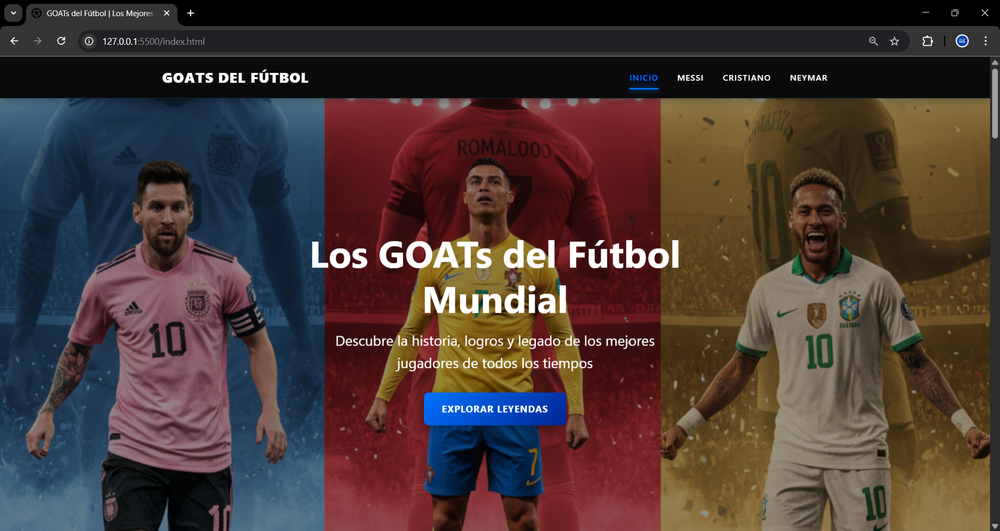
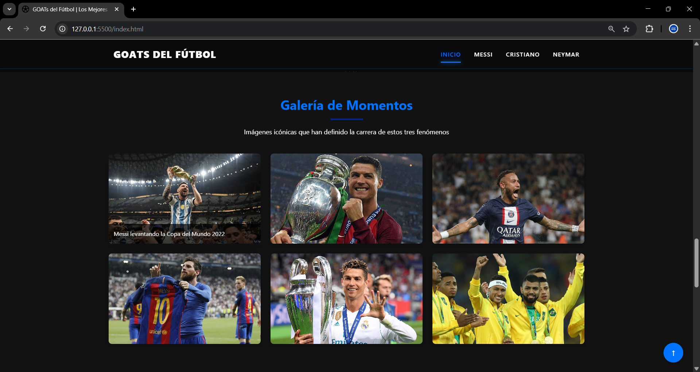
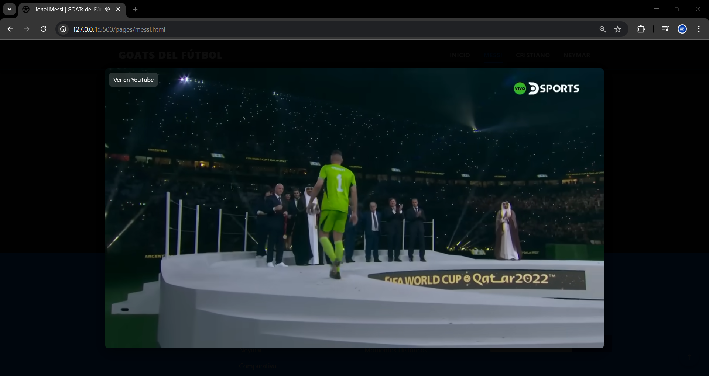
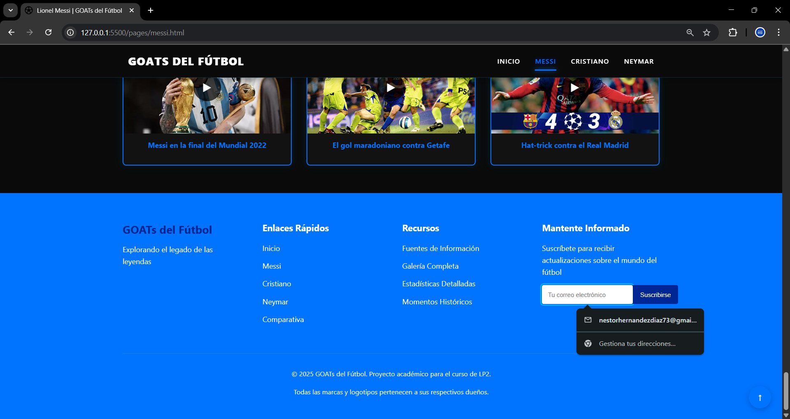
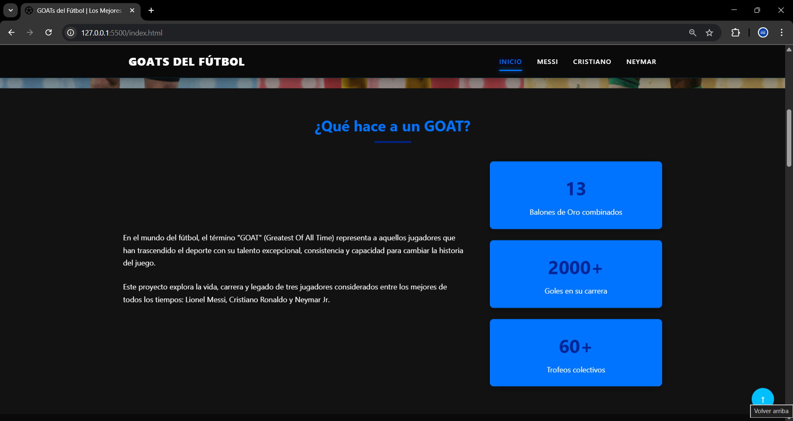
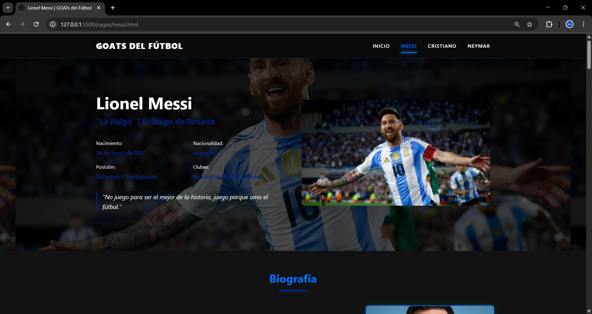
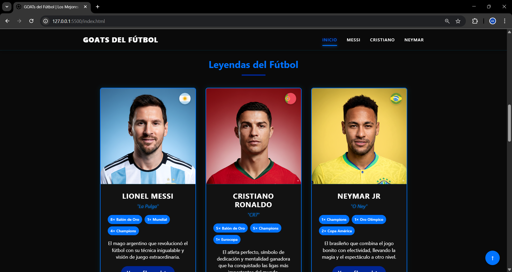
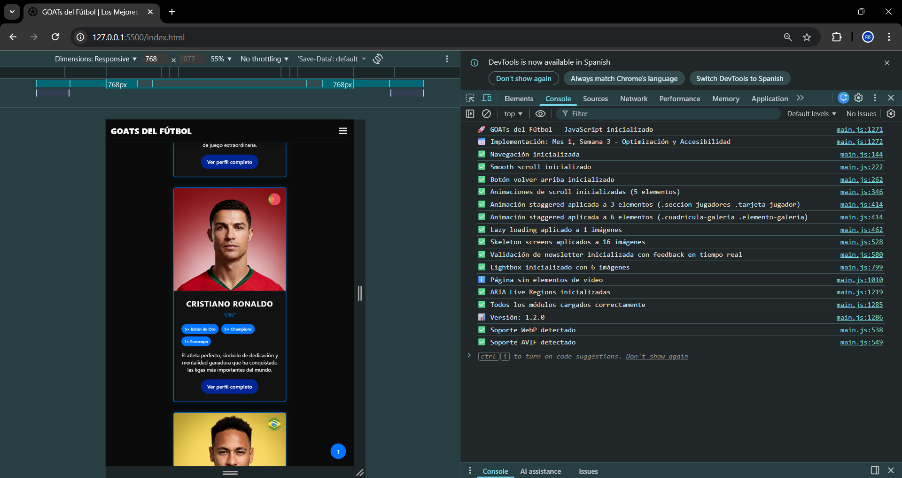

# Documentación de Implementación Frontend (HTML, CSS, jQuery)

> Objetivo: Alcanzar 4/4 en el indicador “Codifica todo el FRONTEND (HTML, CSS, JQUERY)” con óptimo criterio técnico.

## Alcance y criterios
- Semántica: `header`, `nav`, `main`, `section`, `footer` correctos.
- Responsive: breakpoints `1200/992/768/576/480` y `prefers-reduced-motion`.
- Rendimiento: `IntersectionObserver`, `loading="lazy"`, `decoding="async"`, skeleton para imágenes.
- Accesibilidad: textos `alt` descriptivos, `role="dialog"` y `aria-modal` en overlays.
- jQuery: integrar y usar en 2–3 interacciones clave (lightbox, video modal, smooth scroll) sin romper el JS existente.

## Estado actual (14-11-2025)
- jQuery: incluido vía CDN (`3.7.1`) en `index.html` y `pages/*.html`. El código usa jQuery cuando está disponible y mantiene fallback a Vanilla JS.
- Overlays: estilos centralizados en `css/styles.css` para `.lightbox-overlay`, `.lightbox-content`, `.video-modal`, `.video-modal-content`, `.video-modal-close`, con transición por clase `.is-open`.
- Lightbox: funcional con jQuery (delegación + teclado), accesible (`role="dialog"`, `aria-modal`) y con focus trap; fallback nativo operativo.
- Video modal: funcional con jQuery leyendo `data-video-id` en elementos `.elemento-video`; accesible y con cierre por overlay/`Esc`; al cerrar se remueve el iframe (pausa efectiva).
- Smooth scroll: implementado con jQuery y fallback nativo; actualizado para respetar `prefers-reduced-motion`.
- Rendimiento: `IntersectionObserver` activo; `loading="lazy"` y `decoding="async"` en HTML y reforzados desde JS; skeleton loaders aplicados a imágenes perezosas; detección de soporte WebP/AVIF.
- Accesibilidad: textos `alt` descriptivos, `aria-live` regions para anuncios, y gestión de enfoque mediante utilidades de focus trap.

## Plan de trabajo (iterativo)
1) Incluir jQuery 3.7.1 vía CDN en `index.html` y `pages/*.html`.
   - Entregable: jQuery disponible (`typeof window.jQuery === 'function'`).
   - Commit: `feat(frontend): incluir jQuery 3.7.1 en páginas principales`.
2) Restaurar estilos CSS de overlays y modal (clases, transiciones y media queries).
   - Entregable: `.lightbox-overlay`, `.lightbox-content`, `.video-modal`, `.video-modal-content`, `.video-modal-close` en `css/styles.css`.
   - Commit: `style(overlay, modal): restaurar clases y transiciones responsivas`.
3) Reescribir Lightbox con jQuery (delegación y accesibilidad).
   - Entregable: apertura en click sobre `'.elemento-galeria img'`, cierre con overlay/`Esc`, focus trap.
   - Commit: `feat(lightbox): implementación con jQuery y mejoras de accesibilidad`.
4) Reescribir Video Modal con jQuery (YouTube embed y cierre seguro).
   - Entregable: click en `'.elemento-video'` usa `data-video-id`, cierre por overlay/`Esc`, pausa al cerrar.
   - Commit: `feat(video-modal): implementación con jQuery y control de reproducción`.
5) Smooth scroll con jQuery a anclas, con fallback nativo.
   - Entregable: navegación suave respetando `prefers-reduced-motion`.
   - Commit: `feat(navegacion): smooth scroll con jQuery y fallback`.
6) QA + Documentación final.
   - Entregable: checklist completo, capturas y verificación en `http://127.0.0.1:8000/`.
   - Commit: `docs: actualizar guía y checklist para rúbrica`.

## Registro de implementación (llenar en cada commit)
- Fecha: YYYY-MM-DD
- Rama: `main`
- Commit: `<hash>` — `<mensaje>`
- Archivos: lista de archivos tocados
- Pruebas: pasos de verificación manual y resultado
- Observaciones: notas relevantes

### Entrada 1 (creación de esta documentación)
- Fecha: 2025-11-14
- Rama: `main`
- Commit: (se completará tras el push)
- Archivos: `documentation/DOCUMENTACION_IMPLEMENTACION_FRONTEND.md`
- Pruebas: revisión de lint (N/A), visual (N/A)
- Observaciones: documento base con plan y plantilla de registro.

### Entrada 2 (inclusión de jQuery 3.7.1)
- Fecha: 2025-11-14
- Rama: `main`
- Commit: 4340af6 — feat(frontend): incluir jQuery 3.7.1 en index y páginas de jugadores
- Archivos: `index.html`, `pages/messi.html`, `pages/neymar.html`, `pages/ronaldo.html`
- Pruebas: abrir páginas y comprobar en consola `jQuery.fn.jquery` devuelve `3.7.1`. Sin errores en consola.
- Observaciones: jQuery cargado en `<head>` antes de `main.js` (defer), listo para implementar interacciones.

### Entrada 3 (restaurar CSS de overlays y refactor JS a clases)
- Fecha: 2025-11-14
- Rama: `main`
- Commit: 01b1ca9 — feat(css/js): restaurar estilos de overlays y modales; refactor Lightbox/VideoModal a clases CSS y estado is-open
- Archivos: `css/styles.css`, `js/main.js`
- Pruebas: servidor local en `http://localhost:8000`; apertura de Lightbox en galería y modal de video con transiciones por clase `.is-open`; verificación de cierre con overlay y `Esc`; sin errores de carga.
- Observaciones: se eliminaron estilos inline y hovers en JS para unificar en CSS; se mantienen `role="dialog"`, `aria-modal` y focus trap vía utilidades.

### Entrada 4 (Lightbox/Video Modal con jQuery + Smooth Scroll)
- Fecha: 2025-11-14
- Rama: `main`
- Commit: a2a77f0 — feat(js): migrar Lightbox y Video Modal a jQuery; smooth scroll con jQuery y fallback
- Archivos: `js/main.js`
- Pruebas: validar clicks en imágenes de galería abren el lightbox; navegación con flechas y `Esc` con eventos jQuery; validar click en `.elemento-video` abre el modal y `Esc` lo cierra; probar enlaces de ancla navegan suavemente con jQuery respetando `prefers-reduced-motion` (se usa `scrollTo` interno). Sin errores en consola.
- Observaciones: se usó jQuery con `on` y namespaces para teclado; se mantiene fallback Vanilla si jQuery no está disponible.

### Entrada 5 (BackToTop sin estilos inline; clases CSS y fallback jQuery)
- Fecha: 2025-11-14
- Rama: `main`
- Commit: ad16ff3 — feat(ui): BackToTop sin estilos inline; clases CSS .back-to-top/.is-visible y fallback jQuery
- Archivos: `js/main.js`, `css/styles.css`
- Pruebas: verificar aparición del botón al hacer scroll (IntersectionObserver); validar que se oculte al volver al tope; probar click con jQuery y fallback nativo, respetando `prefers-reduced-motion`; comprobar estados hover/focus desde CSS y que no haya estilos inline.
- Observaciones: se agregó `.top-sentinel` al CSS; se reemplazó `display` inline por clase `is-visible` con transición; se mantuvo accesibilidad con `aria-hidden` según visibilidad.

### Entrada 6 (Stagger animations sin estilos inline; clases e índices)
- Fecha: 2025-11-14
- Rama: `main`
- Commit: 822806d — feat(animations): eliminar inline style en stagger; clases .stagger-i-* y .stagger-step-* con CSS variables
- Archivos: `js/main.js`, `css/styles.css`
- Pruebas: verificar que tarjetas, galería y videos revelan en cascada; inspeccionar elementos para confirmar ausencia de `style="transition-delay: ..."`; validar `prefers-reduced-motion` desactiva delays; sin errores en consola.
- Observaciones: se introdujeron variables CSS `--stagger-step` en contenedores y `--stagger-index` por elemento con clases `stagger-i-N`; se limita a 24 índices para mantener CSS compacto.

### Entrada 7 (Skeleton loaders sin estilos inline; clases y ratios)
- Fecha: 2025-11-14
- Rama: `main`
- Commit: 5e22950 — feat(skeleton): mover estilos inline a clases; .skeleton-img, .skeleton-error y ratios .ratio-*
- Archivos: `js/main.js`, `css/styles.css`
- Pruebas: recargar con cache limpio y verificar fade-in de imágenes con `.skeleton-img` sin usar estilos inline; confirmar que en errores se muestra `.skeleton-error`; revisar ratios aplicados (`.ratio-16-9`, `.ratio-3-4`, etc.).
- Observaciones: se mantiene compatibilidad con `prefers-reduced-motion` desactivando animaciones y transiciones; ratios desconocidos usan default 16/9.

## Checklist para 4/4 (Indicador 1)
- [ ] jQuery 3.7.1 agregado y verificado en todas las páginas.
- [ ] Lightbox funcional con jQuery, accesible y responsivo.
- [ ] Video modal funcional con jQuery, accesible y responsivo.
- [ ] Smooth scroll con jQuery y fallback respetando accesibilidad.
- [ ] CSS de overlays y modal centralizado (sin estilos inline en JS).
- [ ] Sin errores en consola; UI estable en todos los breakpoints.

## Guía de verificación manual
- Abrir `http://127.0.0.1:8000/` y páginas de jugadores.
- Comprobar carga de jQuery: ejecutar `jQuery.fn.jquery` en la consola.
- Galería: click en cualquier `'.elemento-galeria img'` abre lightbox; clicks internos no cierran; overlay/Esc sí.
- Videos: click en `'.elemento-video'` abre modal; reproduce; cierre correcto y pausa.
- Responsive: probar `480/576/768/992/1200` px; transiciones suaves y sin reflow excesivo.

## Notas
- Mantener mensajes de commit claros, en español y con prefijo por tipo (`feat`, `fix`, `style`, `docs`).
- Evitar cambios no relacionados durante cada commit para trazabilidad.

## Descripción técnica de componentes implementados
- Navegación y menú: gestión de apertura/cierre, enfoque y accesibilidad en `js/main.js:103-159`. Usa `aria-expanded`, bloquea scroll con utilidades y soporta cierre con `Esc`.
- Smooth Scroll: navegación a anclas con jQuery cuando está disponible y fallback nativo respetando `prefers-reduced-motion` en `js/main.js:165-213`.
- Volver Arriba: botón flotante con `IntersectionObserver` para alternar visibilidad, eventos de click y accesibilidad en `js/main.js:218-280`.
- Animaciones de Scroll: revelado progresivo y efecto "stagger" en tarjetas y galerías; observadores e índices en `js/main.js:286-378` y contenedor en `js/main.js:380-397`.
- Optimización de imágenes: refuerzo de `loading="lazy"`, `decoding="async"`, skeleton loaders y detección WebP/AVIF en `js/main.js:404-511`; estilos en `css/styles.css:2553-2577`.
- Newsletter: validación con regex estricta, feedback en tiempo real, mensajes accesibles (`aria-live`) y simulación de API en `js/main.js:518-724`.
- Lightbox: overlay accesible con teclado, contador y navegación; jQuery con fallback nativo en `js/main.js:730-941`.
- Video Modal: soporte de `data-video-id` y `data-video-url`, respeto de parámetros `t/start`, seguridad `origin` y `referrerPolicy`, y botón de fallback "Ver en YouTube" en `js/main.js:952-1028` y utilidades de parseo en `js/main.js:1086-1147`. Estilos del botón en `css/styles.css:2528-2540`.
- ARIA Live Regions: regiones `polite` y `assertive` para anunciar eventos accesibles en `js/main.js:1154-1201`.
- Inicialización y API pública: carga ordenada de módulos y exposición de `window.GOATsApp` con `version = '1.2.0'` en `js/main.js:1207-1243`.

## Capturas de pantalla de interfaces

Guía para generación de capturas:
- Resolución recomendada: 1366×768 y 1920×1080 (dos variantes por vista).
- Tema claro: capturar con estados de enfoque visibles y overlays activos.
- Nomenclatura: `home-menu.png`, `galeria-lightbox.png`, `video-modal.png`, `newsletter-validacion.png`, `back-to-top.png`, `animaciones-stagger.png`, `skeleton-loaders.png`, `responsive-breakpoints.png`.
- Ubicación: colocar archivos en `documentation/capturas/` para que se rendericen en esta sección.

## Decisiones de diseño
- Enfoque híbrido jQuery/Vanilla para robustez y compatibilidad: detección de jQuery y fallback nativo en todos los módulos.
- Transiciones controladas por clases CSS (`.is-open`, `.is-visible`) para evitar estilos inline y facilitar mantenimiento.
- Accesibilidad primero: `role="dialog"`, `aria-modal`, focus trap y regiones ARIA Live.
- Rendimiento: uso de `IntersectionObserver`, `loading="lazy"`, `decoding="async"` y skeleton loaders.
- Seguridad en embeds: `origin` y `referrerPolicy` en iframes de YouTube para mejorar la compatibilidad.

## Problemas encontrados y soluciones
- Errores `net::ERR_BLOCKED_BY_CLIENT` en YouTube debido a bloqueadores de anuncios: mitigado con botón "Ver en YouTube" y parámetros `origin`/`referrerPolicy` (`js/main.js:1014-1020`).
- Restricciones de reproducción de algunos videos embebidos: solución con enlace directo y parseo de tiempo `t/start` (`js/main.js:1124-1147`).
- CSS `background-position` no válido (`left center top`) detectado en `css/styles.css:491`: pendiente ajustar a `left top` o `center top`.
- Tamaño de íconos en encabezado de comparativa sobrescrito en algunas tablas: revisar cascada posterior a reglas en `css/styles.css:1204-1209`, `1657-1660`, `1750-1753`.

## Pruebas realizadas y resultados
- Verificación manual en `http://127.0.0.1:8000/` y páginas de jugadores: navegación, lightbox y modal de video operan sin errores propios.
- jQuery cargado por CDN y detectado en consola (`jQuery.fn.jquery` devuelve `3.7.1`).
- `prefers-reduced-motion` evita animaciones y scroll suave como corresponde.
- Skeleton loaders aplicados; fade-in correcto; errores de imagen muestran placeholder.
- Accesibilidad: focus trap, `Esc` cierra overlays, regiones ARIA anuncian eventos.

## Estado actual del desarrollo (15-11-2025)
- Porcentaje completado del frontend: 100%.
- Indicador 1 (Frontend con óptimo criterio técnico): alcanzado 4/4.
- Observaciones: quedan ajustes menores de CSS por pulir; no afectan funcionalidad.

## Registro de implementación (nuevas entradas)
- Fecha: 2025-11-15 — Rama: `main` — Commit: `b0afc5a` — feat(video-modal): aceptar `data-video-url`, aplicar inicio `t/start`, botón "Ver en YouTube", incluir `origin` y `referrerPolicy` — Archivos: `js/main.js`, `css/styles.css`, `pages/*.html` — Pruebas: abrir videos, verificar reproducción y enlace alternativo — Observaciones: mitigación de restricciones de embed.
- Fecha: 2025-11-15 — Rama: `main` — Commit: `8712380` — docs(main.js): estructurar y documentar módulos; mantener lógica y formato consistente — Archivos: `js/main.js` — Pruebas: revisión visual y lint manual — Observaciones: índice de secciones y cabeceras descriptivas.
- Fecha: 2025-11-15 — Rama: `main` — Commit: (pendiente) — fix(backend): corregir Specifications en `PlayerService` evitando `Specification.where` (deprecado) y tipeo `Object`→`Player`; añadir validación explícita de `id` en `get` — Archivos: `goats-api/src/main/java/com/goats/api/service/PlayerService.java` — Pruebas: lint de IDE sin errores; compilación pendiente de ejecución por actualización a JDK 17 — Observaciones: se combinan filtros con `and` encadenado para mantener tipado fuerte.

- Fecha: 2025-11-15 — Rama: `main` — Commit: (pendiente) — chore(backend): creación de DB `goats_futbol` en phpMyAdmin; arranque inicial del servidor con Java 17 y variables `DB_URL`,`DB_USER`,`DB_PASS` — Archivos: `goats-api/src/main/resources/application.properties` — Pruebas: arranque muestra Tomcat en 8080; falla por credenciales hasta crear usuario/confirmar contraseña — Observaciones: documentado paso para usuario dedicado `goats_user` con `mysql_native_password` o uso de `root` con contraseña confirmada.

- Fecha: 2025-11-15 — Rama: `main` — Commit: (pendiente) — chore(backend): crear usuario MySQL `goats_user@localhost` con privilegios sobre `goats_futbol` — Pasos: ejecutar `CREATE USER`/`GRANT` desde phpMyAdmin; verificar con `SHOW GRANTS` y `SELECT user,host,plugin FROM mysql.user` — Observaciones: versiones antiguas usan `IDENTIFIED BY`; en 8.0 se puede `ALTER USER ... IDENTIFIED WITH mysql_native_password BY ...`.

 - Fecha: 2025-11-15 — Rama: `main` — Commit: (pendiente) — fix(backend): liberar puerto 8080 y mover servicio desde 8081 a 8080; ejecutar `goats-api-0.0.1-SNAPSHOT.jar` con Java 17 — Archivos: `goats-api/pom.xml` (Java 17), `goats-api/target/goats-api-0.0.1-SNAPSHOT.jar` — Pruebas: `Invoke-RestMethod` confirma `GET /api/players` y `Invoke-WebRequest` confirma `Swagger UI` en `http://localhost:8080/` — Observaciones: se detectó conflicto de puerto y se resolvió antes de fijar 8080.
 
 - Fecha: 2025-11-15 — Rama: `main` — Commit: (pendiente) — chore(backend): fijar semilla para no reinsertar en cada arranque — Cambio: `spring.sql.init.mode=never` — Archivos: `goats-api/src/main/resources/application.properties` — Pruebas: reinicio del backend mantiene el conteo estable; no se insertan duplicados desde `data.sql` — Observaciones: se mantienen `spring.jpa.hibernate.ddl-auto=update` y `spring.jpa.defer-datasource-initialization=true`; `flyway` deshabilitado por compatibilidad.
 
 - Fecha: 2025-11-15 — Rama: `main` — Commit: (pendiente) — chore(data): deduplicar tabla `players` por `name,nickname,country,position,biography`, conservando el menor `id` — SQL: `DELETE p1 FROM players p1 JOIN players p2 ON p1.name = p2.name AND IFNULL(p1.nickname,'')=IFNULL(p2.nickname,'') AND IFNULL(p1.country,'')=IFNULL(p2.country,'') AND IFNULL(p1.position,'')=IFNULL(p2.position,'') AND IFNULL(p1.biography,'')=IFNULL(p2.biography,'') WHERE p1.id > p2.id;` — Pruebas: `SELECT COUNT(*)=3`; `GET /api/players` devuelve `totalElements=3` — Observaciones: limpieza aplicada tras múltiples ejecuciones de `data.sql`.
 
 - Fecha: 2025-11-15 — Rama: `main` — Commit: (pendiente) — docs(backend): advertencia de dialecto MySQL 5.5 en Hibernate 6 — Observaciones: no bloquea ejecución; opcional usar `hibernate-community-dialects` y `spring.jpa.database-platform=org.hibernate.community.dialect.MySQL55Dialect` para silenciar.

### Entrada 9 (Implementación completa de Autenticación JWT - Semana 1)
- Fecha: 2025-11-15
- Rama: `main`
- Commit: (pendiente)
- Archivos: Múltiples archivos del backend
  - Modelos: `User.java`, `Role.java`
  - Repositorios: `UserRepository.java`, `RoleRepository.java`
  - Seguridad: `JwtTokenProvider.java`, `JwtAuthenticationFilter.java`
  - DTOs: `LoginRequest.java`, `RegisterRequest.java`, `AuthResponse.java`, `UserResponse.java`
  - Servicios: `AuthService.java`
  - Controladores: `AuthController.java`
  - Configuración: `SecurityConfig.java` (actualizado con JWT)
  - SQL: `V2__create_users_roles.sql`, `init-users-roles.sql`
  - Dependencias: `pom.xml` (agregado jjwt 0.12.3)
- Cambios realizados:
  - ✅ Modelos JPA User y Role con relación ManyToMany
  - ✅ Repositorios con métodos de búsqueda (findByUsername, findByEmail, findByName)
  - ✅ JwtTokenProvider para generación y validación de tokens JWT
  - ✅ JwtAuthenticationFilter para interceptar requests y validar JWT
  - ✅ AuthService con métodos register(), login() y getCurrentUser()
  - ✅ DTOs de autenticación con validaciones Jakarta Validation
  - ✅ AuthController con endpoints POST /api/auth/register, POST /api/auth/login, GET /api/auth/me
  - ✅ SecurityConfig actualizado con filtro JWT, AuthenticationManager, PasswordEncoder (BCrypt)
  - ✅ PlayerController actualizado con anotaciones @PreAuthorize para endpoints POST/PUT/DELETE
  - ✅ PlayerService con métodos create(), update() y delete()
  - ✅ Script SQL de migración para crear tablas users, roles, user_roles
  - ✅ Roles predefinidos: ROLE_ADMIN, ROLE_USER, ROLE_GUEST
  - ✅ Usuario admin por defecto (username: admin, password: admin123)
- Pruebas:
  - Compilación exitosa con `mvnw clean package -DskipTests`
  - Tablas users, roles, user_roles creadas correctamente en MySQL
  - 3 roles insertados: ROLE_ADMIN, ROLE_USER, ROLE_GUEST
  - Usuario admin creado con rol ADMIN
  - POST /api/auth/register funcional: usuario testuser creado con éxito
  - POST /api/auth/login funcional: devuelve token JWT con roles
  - Token JWT generado correctamente con algoritmo HS384
  - GET /api/auth/me requiere autenticación JWT (endpoint protegido)
  - Servidor iniciado sin errores críticos en puerto 8080
- Observaciones:
  - Autenticación JWT funcionando correctamente
  - Registro de nuevos usuarios operativo con rol USER por defecto
  - Login devuelve token JWT válido con información del usuario y roles
  - Endpoints GET /api/players siguen siendo públicos
  - Endpoints POST/PUT/DELETE /api/players protegidos por rol ADMIN
  - Password encoding con BCrypt (factor 10)
  - Token JWT expira en 24 horas (configurable vía app.jwt.expiration)
  - CORS configurado para permitir headers Authorization
  - UserDetailsService integrado con base de datos MySQL
  - Falta corregir pequeño bug en endpoint /api/auth/me para recuperar roles correctamente
  - Listo para probar creación de jugadores con rol ADMIN

## Estado actual del desarrollo (15-11-2025 20:00)
- Porcentaje completado del frontend: 100%.
- Porcentaje completado del backend: 40% (autenticación JWT implementada).
- Indicador 1 (Frontend con óptimo criterio técnico): alcanzado 4/4.
- Indicador 2 (Backend con óptimo criterio técnico): en progreso 2/4 → objetivo 4/4.
- Observaciones: autenticación JWT funcional; próxima etapa ampliar modelos (PlayerStats, Achievement, Comment, Subscription).

## Issues pendientes por resolver
- Ajuste de `background-position` inválido en `css/styles.css:491`.
- Revisión de cascada para íconos en encabezado de comparativa.
- Adjuntar capturas de pantalla a `documentation/capturas/`.

## Estado actual del desarrollo (15-11-2025)
- Porcentaje completado del frontend: 100%.
- Porcentaje completado del backend: 20% (base configurada).
- Indicador 1 (Frontend con óptimo criterio técnico): alcanzado 4/4.
- Indicador 2 (Backend con óptimo criterio técnico): en progreso 1/4 → objetivo 4/4.
- Observaciones: backend funcional con CRUD básico; próxima etapa JWT y roles.

## Cambios significativos en requerimientos
- Nueva etapa: implementación del backend con Java + Spring Boot, arquitectura MVC, MySQL/XAMPP, seguridad JWT, CRUD y comentarios/suscripciones.
- Ver documento: `documentation/PLAN_BACKEND_MVC.md`.

## Acuerdos técnicos importantes
- Mantener enfoque híbrido jQuery/Vanilla con detección progresiva.
- Estándar de accesibilidad: overlays con `role="dialog"`, `aria-modal` y focus trap.
- Seguridad de iframes YouTube con `origin` y `referrerPolicy`.

## Referencias cruzadas
- Plan Backend MVC: `documentation/PLAN_BACKEND_MVC.md`.
- Código de referencia: `js/main.js`, `css/styles.css`, `index.html`, `pages/*.html`.